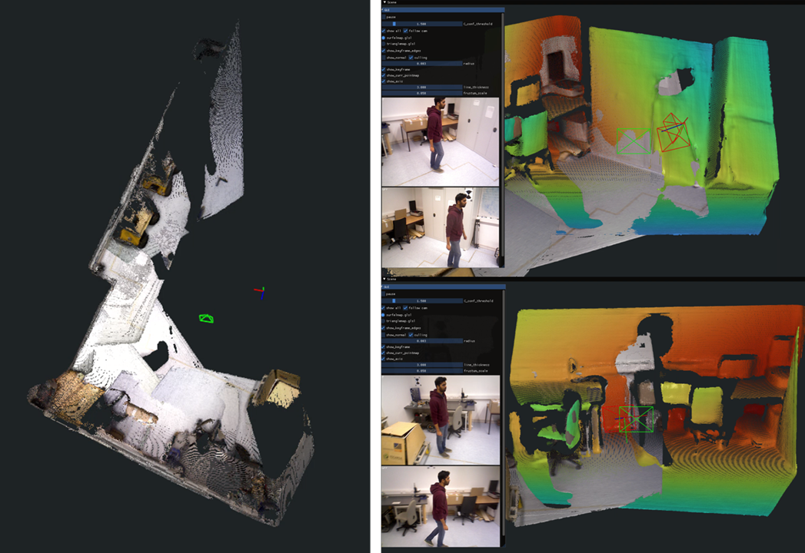

# 👋 Hello, I'm Yewon Kim
### 3D Vision & SLAM Researcher | Master's Student at Korea University

I am passionate about bridging the gap between the physical and digital worlds through **3D Vision** and **Deep Learning**. 
My research focuses on building robust SLAM systems for dynamic environments and real-time applications.

## 📺 Project Demo : Real-time RGB Dynamic SLAM with Pixel-wise Motion Masking

(Click the image to watch the demo video)

**1. Problem: Limitations of Object-level Masking**
In online SLAM systems, ensuring **Tracking Stability** is critical to maintain continuous camera localization. 
Existing **Object-level masking methods** tend to remove entire dynamic objects, even when parts of them remain static. While this approach may be advantageous for reconstruction, it leads to **Feature Starvation** in crowded scenes where dynamic objects dominate the field of view. This depletion of matching information often results in immediate **Tracking Failure** and frequent **Relocalization**.

**2. Solution: Pixel-wise Motion Masking**
To address this, I proposed **Pixel-wise Motion Masking**, a method that goes beyond simple object removal by identifying and masking only the pixels that are actually moving at the current moment.
- **Methodology**: By integrating **Dense Geometric Prior (DUSt3R)** with **Dense Point Tracking (All-Tracker)**, the system precisely identifies dynamic pixels based on the discrepancy between scene flow and point tracking.
- **Tracking Stability**: This approach actively utilizes **Temporarily Static Parts** within dynamic objects as valid matching features. This maximizes the number of effective tracking points, ensuring stability even in highly dynamic environments.

**3. Performance**
Unlike existing State-of-the-Art(WildGS-SLAM, Dec 2025) methods that are limited to 0.5–2 FPS, this system achieves **real-time performance of over 15 FPS**.

## 🛠 Tech Stack
- **Core**: Python, C++, C#
- **AI/Vision**: PyTorch, OpenCV, OpenGL
- **Robot/AR/VR**: Arduino, Unity, SLAM

## 🚀 Projects

### 1. Real-time RGB Dynamic SLAM with Pixel-wise Motion Masking
**"Achieving 15 FPS Real-time SLAM (faster than SOTA WildGS-SLAM)- Dec 2025"**
- **Period**: Mar 2024 – Present
- **Role**: Core Algorithm Research & Implementation, Application for Quadruped Robots
- **Key Achievement**: Successfully resolved tracking loss in highly dynamic scenes by implementing a deep learning-based motion masking pipeline.
- **Performance**: Optimized for real-time inference (15 FPS) on RTX 4090, outperforming WildGS-SLAM (1-3 FPS).

### 2. Digital Human Generation (KIST)
**"Photorealistic 3D Human Head Modeling & Technology Transfer"**
- **Period**: Jun 2023 – Dec 2023
- **Role**: Undergraduate Research Intern (KIST)
- **Description**: Contributed to a technology transfer project aimed at commercializing high-fidelity 3D avatars.
- **Contribution**: Executed data preprocessing pipelines for large-scale 3D facial datasets and validated model performance.

---
### 📫 Contact
- **Email**: gyw1teens@gmail.com
- **LinkedIn**: www.linkedin.com/in/yewon-kim-6a8a20366
- **Location**: Seoul, South Korea
