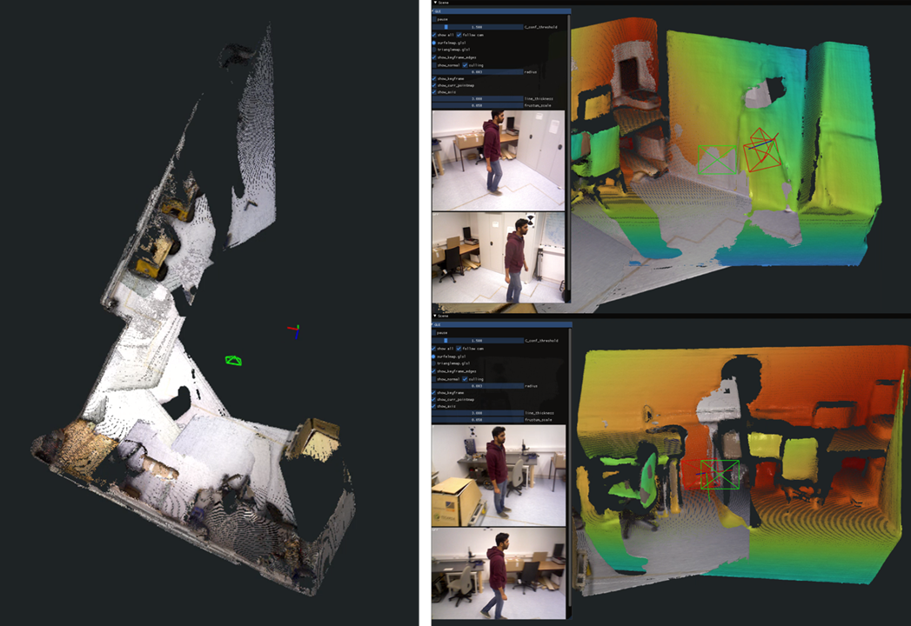
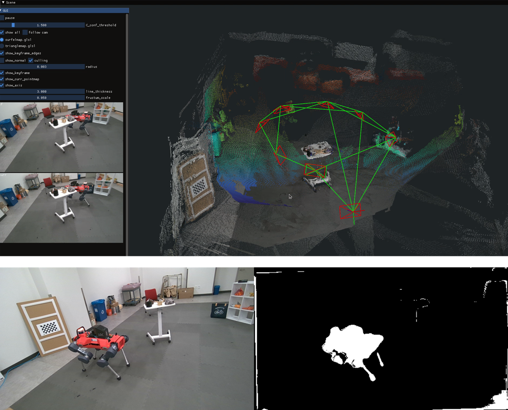
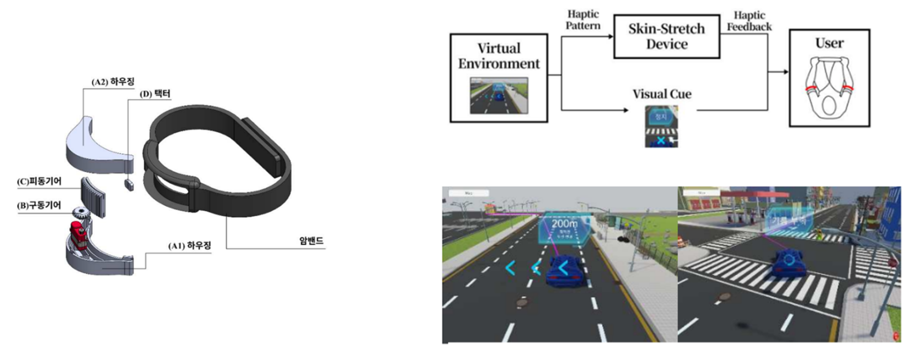

# 👋 Hello, I'm Yewon Kim
### 3D Vision & SLAM Researcher | Master's Student at Korea University

I am passionate about bridging the gap between the physical and digital worlds through **3D Vision** and **Deep Learning**. 

My research focuses on building robust SLAM systems for dynamic environments and real-time applications.

---

## 📄 Latest Research (IROS 2026 Submitted)
### **All-St3R SLAM: Real-time RGB Dynamic SLAM with Pixel-wise Motion Masking**

[**[Paper (PDF)]**](https://drive.google.com/file/d/1nAlEuM95CJSnktXZ3p32tRAsq1tI-rPl/view?usp=sharing) | [**[Supplementary Video]**](https://youtu.be/1vgPLqjW0Xg)
> 🚨 **Click the Link above to watch the IROS 2026 Supplementary Video!**

[**[Demo Video]**](https://youtu.be/Kaef6XRzZyU)

### Overview

Existing dynamic SLAM approaches still have several limitations like **over-removal** and **high computational costs**.

We propose a real-time RGB Dynamic SLAM framework that precisely removes moving objects at the pixel level **without relying on predefined labels or segmentation models**. Our system combines pixel motion predicted by ego-motion using **DUSt3R** with point tracking from **All-Tracker**, removing only actually moving pixels by analyzing discrepancies between the two motion sources. Unlike object-level masking methods, our approach eliminates only currently moving regions, allowing temporarily static parts to be utilized for tracking.

- ✅ No Predefined Labels
- ✅ No GT Depth
- ✅ No Segmentation & Detection Models
- ✅ ~10 FPS on a single NVIDIA RTX 4090

### Key Contributions

- **Dynamic removal without segmentation or detection models**
  Detects dynamic regions purely from geometric discrepancy without relying on object-level segmentation or detection networks. This label-free formulation generalizes to unseen objects and preserves static pixels within partially moving objects, significantly reducing over-removal.

- **Robust tracking via progressive dynamic masking**
  Unlike single-step object removal strategies that risk discarding useful correspondences, our method progressively accumulates motion inconsistencies across frames, enabling robust tracking in dynamic scenes.

- **Real-time RGB-only framework**
  Our system operates at approximately **10 FPS**, enabling real-time performance on standard 30 FPS video streams by subsampling every 3 frames — significantly outperforming state-of-the-art dense hybrid methods (**0.5–3 FPS**).

## 🛠 Tech Stack

| Category | Skills |
| :--- | :--- |
| **Core** | Python, C++, C# |
| **AI / Vision** | PyTorch, OpenCV, OpenGL, Open3D, Blender, MeshLab |
| **Robot / AR / VR** | Arduino, Unity, SLAM, HTC VIVE, Meta Quest |

## 🎓 Education

### Korea University
**M.S. in Computer Science (Major in AI Applications)**
> *Mar 2024 – Feb 2026 (Expected)*
- **Advisor**: Prof. Paul Hong-Seok Seo (MIIL Lab)

### Hongik University
**B.S. in Computer Engineering**
> *Mar 2020 – Feb 2024*
- **Advisor**: Prof. Jae-Young Park (HSIR Lab) > *Jun 2022 – Jun 2023*

## 💼 Experience

### Korea Institute of Science and Technology (KIST)
*Seoul, South Korea*

**Graduate Student Researcher | AI & Robotics Institute**
> *Mar 2024 – Present*
- **Focus**: **Monocular RGB Dynamic SLAM**
- Research on deep learning-based SLAM systems in dynamic environments.

**Undergraduate Research Intern | AI & Robotics Institute**
> *Jun 2023 – Dec 2023*
- **Focus**: **3D Human Head Modeling**
- Data preprocessing for large-scale 3D multi-view facial datasets to ensure model training quality.

## 📜 Projects & Research

### [2024] Master's Coursework Projects

**1. 3D Reconstruction from Sparse-view Pose-Free Images**
- **Course**: Artificial Super Intelligence
- **Description**: Reconstructed 3D scenes from sparse images without camera pose information using deep learning models.

**2. 3D Mesh & Point Cloud Viewer**
- **Course**: Visual Computing
- **Tech**: C++, OpenGL
- **Description**: Developed a viewer to visualize 3D Meshes and Point Clouds.

**3. Adaptive Hand Gesture Implementation**
- **Course**: Basics of VR/AR
- **Tech**: Unity
- **Description**: Implemented a system where hand gestures change adaptively based on the size of virtual objects.

### [2023] Award & Paper & Undergraduate Project

**1. Haptic Interface for AR/VR Realism 🏆**
- **Award**: **Excellence Award** (Hongik Univ. Graduation Exhibition)
- **Role**: Development of a haptic interface maximizing realism and gesture application.
- **Description**: Created a wearable device to enhance immersion in AR/VR environments.
- **Links**: [🔗 Demo](https://www.youtube.com/watch?v=-RJZX_VnEtY&t=383s) *(Demo starts at 6:23)*

<table>
  <tr>
    <td align="center"></td>
    <td align="center"></td>
  </tr>
</table>

**2. Feeling the Hit: Haptic Impact for Realistic Virtual Punch 📝**
- **Type**: Research Project (Submitted to VRST 2023)
- **Description**: Proposed and experimented with a haptic interface that provides realistic impact feedback for virtual punching interactions.
- **Links**: [🔗Paper](https://drive.google.com/file/d/1xLS96gyyfeGryjI3FT78jPWnHXA1y16Y/view?usp=sharing)

<table>
  <tr>
    <td align="center"></td>
    <td align="center"></td>
  </tr>
</table>

**3. Metaverse Marketplace "Carrot Market Pro"**
- **Course**: Computer Graphics & Metaverse
- **Tech**: LiDAR, Unity
- **Description**: Built a metaverse platform utilizing LiDAR scans to upload and view real-world items for second-hand trading.

### [2022] Conference Paper 

**Wearable Haptic System for Car Navigation 📝**
- **Publication**: The Korean Society of Mechanical Engineers (KSME) Autumn Conference
- **Description**: Proposed a wearable haptic system to provide navigation cues to drivers.
- **Links**: [🔗Paper](https://www.dbpia.co.kr/journal/articleDetail?nodeId=NODE11183222)

### [2021] Award

**Android RPG Escape Game using Unity 🏆**
- **Award**: **Silver Award** (Hongik Univ. Project Competition)
- **Description**: Developed an Android-based RPG escape game.
- **Links**: [🔗PPT README](https://github.com/cwj980119/Unity-Escape_T)

---
### 📫 Contact
- **Email**: gyw1teens@gmail.com
- **LinkedIn**: www.linkedin.com/in/yewon-kim-6a8a20366
- **Location**: Seoul, South Korea
